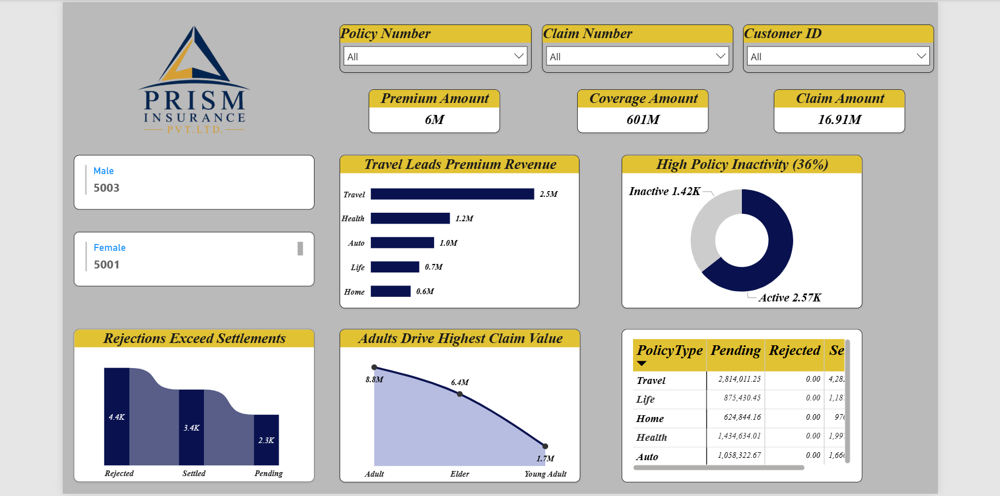
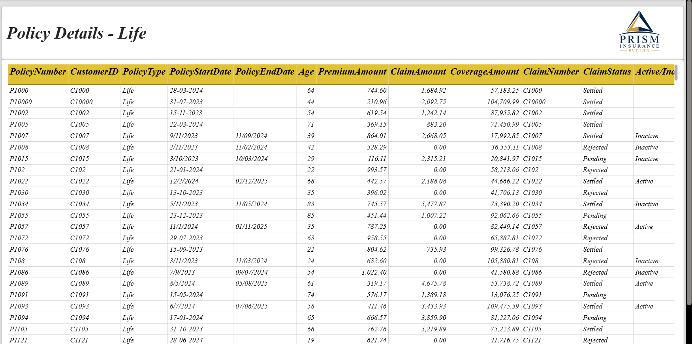
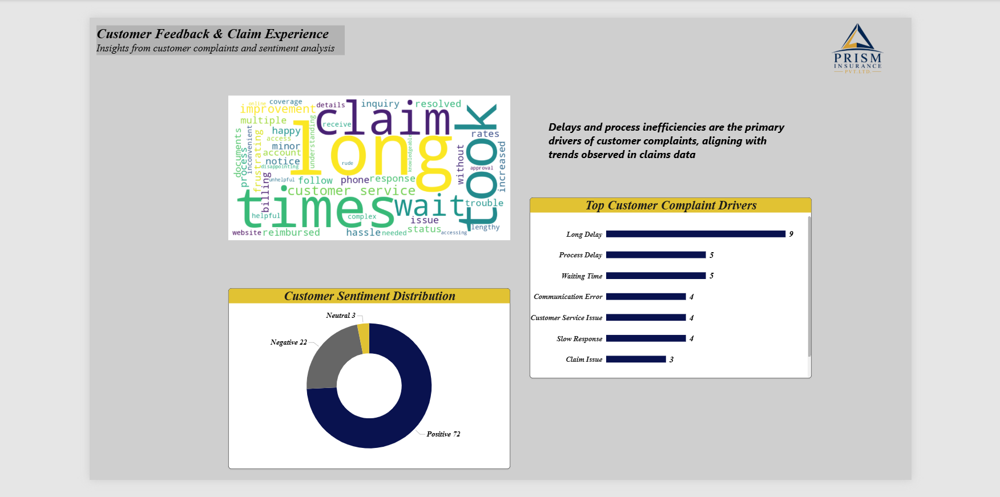

# 🛡️ Insurance Claims & Customer Feedback Dashboard (Power BI)

## 📌 Project Overview

I built a multi-page Power BI dashboard combining operational metrics with customer sentiment analysis to not only track performance but also identify underlying drivers of customer dissatisfaction.

The dashboard integrates insurance policy data with customer feedback insights to provide a holistic view of business performance, claim activity, and customer experience.

---

## 🎯 Objectives

* Analyze insurance premiums, claims, and coverage trends
* Monitor policy activity and identify inactivity patterns
* Enable drill-through analysis for detailed policy-level insights
* Understand customer sentiment and identify key complaint drivers
* Connect operational metrics with customer feedback

---

## 📊 Dashboard Structure

### 🔹 Page 1 – Overview Dashboard

* Key KPIs: Premium Amount, Coverage Amount, Claim Amount
* Policy inactivity analysis
* Revenue distribution by policy type
* Claim trends and demographic insights

---

### 🔹 Page 2 – Policy-Level Details (Drill-through)

* Detailed view of individual policies
* Filtered by selected Policy Type
* Includes:

  * Policy dates
  * Customer information
  * Claim status
  * Premium and coverage values

---

### 🔹 Page 3 – Customer Feedback & Claim Experience

* Word cloud of customer complaints
* Top complaint drivers (e.g., delays, process inefficiencies)
* Sentiment distribution (Positive, Negative, Neutral)

💡 **Key Insight:**
Delays and process inefficiencies are the primary drivers of customer complaints, aligning with trends observed in claims data.

---

## 🛠️ Tools & Technologies

* Power BI
* DAX (Data Analysis Expressions)
* Data Modeling
* Data Visualization

---

## 📈 Key Features

* Interactive filters and slicers
* Drill-through functionality
* Multi-page analytical storytelling
* Integration of structured and unstructured data
* Clean and consistent dashboard design

---

## 📸 Dashboard Preview

---

## 🚀 How to Use

1. Open the `.pbix` file in Power BI Desktop
2. Use slicers to filter data dynamically
3. Right-click on visuals to access drill-through (Page 2)
4. Explore customer sentiment insights on Page 3

---

## 💡 Project Summary

This project demonstrates the ability to combine business metrics with customer sentiment analysis to move beyond descriptive analytics and uncover actionable insights that impact customer satisfaction and operational efficiency.

---

## 👤 Author

**Nupur Mehta**
Aspiring Data Analyst
Ahmedabad, India

**Skills:** SQL • Python • Power BI • Tableau • Excel

🔗 LinkedIn: https://www.linkedin.com/in/nupurnmehta
📧 Email: nupurmehta996@gmail.com

---

